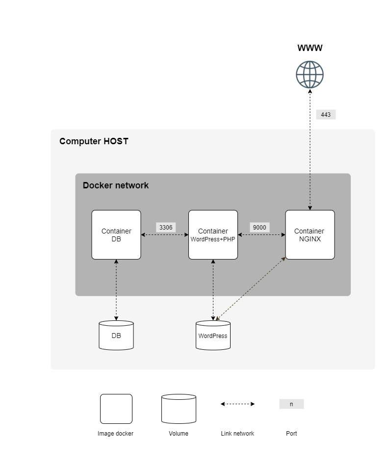

# Inception 🇪🇸
Este proyecto tiene como objetivo ampliar tus conocimientos sobre administración de sistemas mediante el uso de Docker. Virtualizarás varias imágenes de Docker y las crearás en tu nueva máquina virtual personal.

# Proyecto de Infraestructura con Docker Compose

## Parte Obligatoria

Este proyecto consiste en configurar una pequeña infraestructura compuesta por diferentes servicios bajo reglas específicas. Todo el proyecto debe realizarse en una máquina virtual. Se debe utilizar **Docker Compose**.

Cada imagen de Docker debe tener el mismo nombre que su servicio correspondiente.  
Cada servicio debe ejecutarse en un contenedor dedicado.

Por razones de rendimiento, los contenedores deben construirse ya sea desde la penúltima versión estable de Alpine o Debian. La elección es tuya.

Además, tienes que escribir tus propios Dockerfiles, uno por cada servicio. Los Dockerfiles deben ser llamados en tu archivo `docker-compose.yml` por tu Makefile. Esto significa que debes construir tú mismo las imágenes de Docker de tu proyecto. Está prohibido usar imágenes Docker ya preparadas o servicios como DockerHub (exceptuando Alpine/Debian de esta regla).

Luego, debes configurar:

- Un contenedor Docker que contenga **NGINX** con TLSv1.2 o TLSv1.3 únicamente.
- Un contenedor Docker que contenga **WordPress + php-fpm** (debe estar instalado y configurado) sin nginx.
- Un contenedor Docker que contenga **MariaDB** sin nginx.
- Un volumen que contenga la base de datos de WordPress.
- Un segundo volumen que contenga los archivos del sitio web de WordPress.
- Una red Docker que establezca la conexión entre tus contenedores.

Tus contenedores deben reiniciarse en caso de un fallo.  
Un contenedor Docker no es una máquina virtual. Por lo tanto, no se recomienda utilizar parches hacky basados en 'tail -f' y otros similares al intentar ejecutarlos. Lee sobre cómo funcionan los demonios y si es una buena idea utilizarlos o no.

Por supuesto, está prohibido usar `network: host`, `--link` o `links:`. La línea de red debe estar presente en tu archivo `docker-compose.yml`.

Los contenedores no deben iniciarse con un comando que ejecute un bucle infinito. Esto también se aplica a cualquier comando utilizado como entrypoint o en scripts de entrypoint. A continuación, algunos parches hacky prohibidos: `tail -f`, `bash`, `sleep infinity`, `while true`.  
Lee sobre el PID 1 y las mejores prácticas para escribir Dockerfiles.

- En tu base de datos de WordPress, deben haber dos usuarios, uno de ellos siendo el administrador. El nombre de usuario del administrador no puede contener "admin" ni "administrator" (ej. admin, administrator, admin-123, etc.).

Tus volúmenes estarán disponibles en la carpeta `/home/login/data` de la máquina anfitriona usando Docker. Debes reemplazar "login" por el tuyo.

Para simplificar, tienes que configurar tu nombre de dominio para que apunte a tu dirección IP local.  
Este nombre de dominio debe ser `login.42.fr`. Nuevamente, debes usar tu propio login.  
Por ejemplo, si tu login es "wil", `wil.42.fr` redirigirá a la dirección IP apuntando al sitio web de "wil".

El uso de la etiqueta `latest` está prohibido.

No debe haber contraseñas presentes en tus Dockerfiles.  
Es obligatorio utilizar variables de entorno.

Además, se recomienda encarecidamente utilizar un archivo `.env` para almacenar las variables de entorno. El archivo `.env` debe ubicarse en la raíz del directorio `srcs`.

Tu contenedor NGINX debe ser el único punto de entrada a tu infraestructura a través del puerto 443 únicamente, utilizando el protocolo TLSv1.2 o TLSv1.3.

### Aquí hay un diagrama de ejemplo




### Estructura de Directorios Esperada

```bash
$> ls -alR
total XX
drwxrwxr-x 3 wil wil 4096 abril 42 20:42 .
drwxrwxrwt 17 wil wil 4096 abril 42 20:42 ..
-rw-rw-r-- 1 wil wil XXXX abril 42 20:42 Makefile
drwxrwxr-x 3 wil wil 4096 abril 42 20:42 srcs

./srcs:
total XX
drwxrwxr-x 3 wil wil 4096 abril 42 20:42 .
drwxrwxr-x 3 wil wil 4096 abril 42 20:42 ..
-rw-rw-r-- 1 wil wil XXXX abril 42 20:42 docker-compose.yml
-rw-rw-r-- 1 wil wil XXXX abril 42 20:42 .env
drwxrwxr-x 5 wil wil 4096 abril 42 20:42 requirements

./srcs/requirements:
total XX
drwxrwxr-x 5 wil wil 4096 abril 42 20:42 .
drwxrwxr-x 3 wil wil 4096 abril 42 20:42 ..
drwxrwxr-x 4 wil wil 4096 abril 42 20:42 mariadb
drwxrwxr-x 4 wil wil 4096 abril 42 20:42 nginx
drwxrwxr-x 4 wil wil 4096 abril 42 20:42 wordpress

./srcs/requirements/mariadb:
total XX
drwxrwxr-x 4 wil wil 4096 abril 42 20:45 .
drwxrwxr-x 5 wil wil 4096 abril 42 20:42 ..
-rw-rw-r-- 1 wil wil XXXX abril 42 20:42 Dockerfile
-rw-rw-r-- 1 wil wil XXXX abril 42 20:42 .dockerignore
[...]

./srcs/requirements/nginx:
total XX
drwxrwxr-x 4 wil wil 4096 abril 42 20:42 .
drwxrwxr-x 5 wil wil 4096 abril 42 20:42 ..
-rw-rw-r-- 1 wil wil XXXX abril 42 20:42 Dockerfile
-rw-rw-r-- 1 wil wil XXXX abril 42 20:42 .dockerignore
[...]
$> cat srcs/.env
DOMAIN_NAME=wil.42.fr
# MYSQL CONFIGURATION
MYSQL_ROOT_PASSWORD=XXXXXXXXXXXX
MYSQL_USER=XXXXXXXXXXXX
MYSQL_PASSWORD=XXXXXXXXXXXX
[...]
```

### ¿Cómo haría yo el proyecto?

1. **Configurar el entorno de desarrollo**:
   - Crear una máquina virtual (preferiblemente con Ubuntu) que ejecutará todos los servicios.
   - Instalar Docker y Docker Compose.
   
2. **Desarrollo de los servicios en Docker**:
   - Crear un directorio principal con una estructura clara que incluya todos los servicios: NGINX, WordPress, MariaDB.
   - Crear un **Dockerfile** para cada servicio (uno para NGINX, otro para WordPress con PHP-FPM y otro para MariaDB).
   
3. **Configuración de NGINX con TLS**:
   - Configurar un contenedor para NGINX con soporte para TLSv1.2 o TLSv1.3.
   - Generar certificados SSL (puedes usar OpenSSL para generar certificados autofirmados en un entorno de prueba).

4. **Configurar la base de datos**:
   - Configurar MariaDB en su propio contenedor, con volúmenes para persistencia de datos.
   - Crear un Dockerfile para instalar MariaDB desde Debian o Alpine.

5. **Configurar WordPress**:
   - Instalar WordPress y PHP-FPM en un contenedor separado, asegurándome de que se conecte correctamente a la base de datos MariaDB.

6. **Definir la red en Docker Compose**:
   - Crear una red interna en Docker para conectar todos los contenedores.
   - Asegurarse de que el tráfico HTTP se redirija a HTTPS (puerto 443).

7. **Configuración de los volúmenes**:
   - Crear volúmenes para almacenar los datos de la base de datos y los archivos de WordPress.

8. **Testing**:
   - Asegurarme de que todo funcione correctamente: NGINX sirve WordPress, la base de datos está conectada y los certificados SSL están instalados.
   - Crear y probar usuarios en la base de datos de WordPress.

Con estos pasos, el proyecto estaría estructurado y funcional según los requisitos.

# Inception 🇬🇧
This project aims to expand your knowledge of system administration by using Docker. You will virtualize several Docker images and build them in your new personal virtual machine.

# Infrastructure Project with Docker Compose

## Mandatory Part

This project consists of setting up a small infrastructure composed of different services under specific rules. The entire project must be done in a virtual machine. **Docker Compose** must be used.

Each Docker image must have the same name as its corresponding service.
Each service must run in a dedicated container.

For performance reasons, containers must be built from either the penultimate stable version of Alpine or Debian. The choice is yours.

Also, you have to write your own Dockerfiles, one for each service. Dockerfiles must be called in your `docker-compose.yml` file by your Makefile. This means that you must build your project's Docker images yourself. It is forbidden to use ready-made Docker images or services like DockerHub (except Alpine/Debian from this rule).

Then, you need to set up:

- A Docker container containing **NGINX** with TLSv1.2 or TLSv1.3 only.
- A Docker container containing **WordPress + php-fpm** (must be installed and configured) without nginx.
- A Docker container containing **MariaDB** without nginx.
- A volume containing the WordPress database.
- A second volume containing the WordPress website files.
- A Docker network establishing the connection between your containers.

Your containers must be restarted in case of a failure.
A Docker container is not a virtual machine. Therefore, it is not recommended to use hacky patches based on 'tail -f' and similar when trying to run them. Read about how daemons work and whether it is a good idea to use them or not.

Of course, using `network: host`, `--link` or `links:` is prohibited. The network line must be present in your `docker-compose.yml` file.

Containers should not be started with a command that runs an infinite loop. This also applies to any command used as an entrypoint or in entrypoint scripts. Here are some hacky forbidden patches: `tail -f`, `bash`, `sleep infinity`, `while true`.
Read about PID 1 and best practices for writing Dockerfiles.

- In your WordPress database, there must be two users, one of them being the administrator. The administrator username cannot contain "admin" or "administrator" (e.g. admin, administrator, admin-123, etc.).

Your volumes will be available in the `/home/login/data` folder on the host machine using Docker. You must replace "login" with your own.

For simplicity, you need to configure your domain name to point to your local IP address.
This domain name should be `login.42.fr`. Again, you must use your own login.
For example, if your login is "wil", `wil.42.fr` will redirect to the IP address pointing to the "wil" website.

The use of the `latest` tag is prohibited.

There should be no passwords present in your Dockerfiles.
It is mandatory to use environment variables.

Also, it is highly recommended to use a `.env` file to store environment variables. The `.env` file should be located in the root of the `srcs` directory.

Your NGINX container should be the only entry point to your infrastructure via port 443 only, using the TLSv1.2 or TLSv1.3 protocol.

### Here is an example diagram


### Expected Directory Structure

```bash
$> ls -alR
total XX
drwxrwxr-x 3 wil wil 4096 abril 42 20:42 .
drwxrwxrwt 17 wil wil 4096 abril 42 20:42 ..
-rw-rw-r-- 1 wil wil XXXX abril 42 20:42 Makefile
drwxrwxr-x 3 wil wil 4096 abril 42 20:42 srcs

./srcs:
total XX
drwxrwxr-x 3 wil wil 4096 abril 42 20:42 .
drwxrwxr-x 3 wil wil 4096 abril 42 20:42 ..
-rw-rw-r-- 1 wil wil XXXX abril 42 20:42 docker-compose.yml
-rw-rw-r-- 1 wil wil XXXX abril 42 20:42 .env
drwxrwxr-x 5 wil wil 4096 abril 42 20:42 requirements

./srcs/requirements:
total XX
drwxrwxr-x 5 wil wil 4096 abril 42 20:42 .
drwxrwxr-x 3 wil wil 4096 abril 42 20:42 ..
drwxrwxr-x 4 wil wil 4096 abril 42 20:42 mariadb
drwxrwxr-x 4 wil wil 4096 abril 42 20:42 nginx
drwxrwxr-x 4 wil wil 4096 abril 42 20:42 wordpress

./srcs/requirements/mariadb:
total XX
drwxrwxr-x 4 wil wil 4096 abril 42 20:45 .
drwxrwxr-x 5 wil wil 4096 abril 42 20:42 ..
-rw-rw-r-- 1 wil wil XXXX abril 42 20:42 Dockerfile
-rw-rw-r-- 1 wil wil XXXX abril 42 20:42 .dockerignore
[...]

./srcs/requirements/nginx:
total XX
drwxrwxr-x 4 wil wil 4096 abril 42 20:42 .
drwxrwxr-x 5 wil wil 4096 abril 42 20:42 ..
-rw-rw-r-- 1 wil wil XXXX abril 42 20:42 Dockerfile
-rw-rw-r-- 1 wil wil XXXX abril 42 20:42 .dockerignore
[...]
$> cat srcs/.env
DOMAIN_NAME=wil.42.fr
# MYSQL CONFIGURATION
MYSQL_ROOT_PASSWORD=XXXXXXXXXXXX
MYSQL_USER=XXXXXXXXXXXX
MYSQL_PASSWORD=XXXXXXXXXXXX
[...]
```
